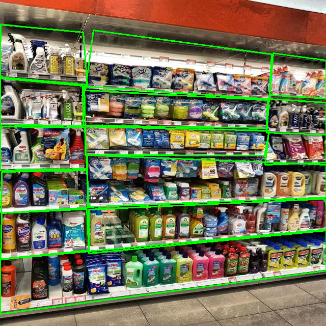

# FindMe's Artifacts
This repo archived artifacts that being used for FindMe Network Platform including: 
- Yolov5 finetunning model for shelves object detection
- Flask Restful API for in-memory product storage
- Augmented Reality Integration with Yolov5 Model

## I) Set Up on Terminal

1) Setup Python Virutal Envrionment
```console
python3 -m venv my_env
source my_env/bin/activate
```
2. Install necessary packages
```console
pip install requirements.txt
```
3. Install Yolov5
```console
!git clone https://github.com/ultralytics/yolov5 
%cd yolov5
%pip install requirements.txt 
```

4. Trained Yolov5 Model for Shelves Detection

### a)Data & Package Requirement
<u>Data:</u> [Shelf Data](https://universe.roboflow.com/shelfdetect-yzkro/shelves-ugxt3)

Download via Terminal:

```console
curl -L "https://universe.roboflow.com/ds/xqNtUFMQGl?key=ZbrZLGgoFF" > roboflow.zip; unzip roboflow.zip; rm roboflow.zip
```

<u>Packages used:</u> cv2, numpy, YOLOv5

### b) Implementations
<u>Why YOLOv5 instead of Faster R-CNN?</u>

YOLOv5 provides accuracy bounding box while Object detection detects more box + further potential of upgrading to Yolov8 Model which could outperforms any other CV models 

<u>Training Steps</u>
```console
python yolov5/train.py --img 640 --batch 16 --epochs 50 --data Data/data.yaml --weights yolov5s.pt --cache
```
<u>Monitoring Training Process</u>
```console
tensorboard --logdir=runs/train
```
<u>Evaluation</u>
```console
python yolov5/val.py --weights runs/train/exp/weights/best.pt --data Data/data.yaml --img 640
```

<u>Results</u>


## III) Artifact2: API for Products

### a) Installation
Package requirements: flask, threading

### b) Implementations
CRUD operations
Postman testing API

### c) Execution


### 1. **Create (POST)**

- **URL:** `http://127.0.0.1:5000/products`  
- **Method:** `POST`  
- **Body:**
  ```json
  {
    "id": 1,
    "name": "Laptop",
    "description": "A high-performance laptop",
    "price": 999.99,
    "quantity": 50
  }
  ```

---

### 2. **Read (GET)**

- **URL:** `http://127.0.0.1:5000/products`  
- **Method:** `GET`  


---

### 3. **Update (PUT)**

- **URL:** `http://127.0.0.1:5000/products/1` (assuming you're updating the product with id 1)  
- **Method:** `PUT`  
- **Body:**
  ```json
  {
    "id": 1,
    "name": "Laptop",
    "description": "An upgraded high-performance laptop",
    "price": 1099.99,
    "quantity": 45
  }
  ```

---

### 4. **Delete (DELETE)**

- **URL:** `http://127.0.0.1:5000/products/1` (assuming you're deleting the product with id 1)  
- **Method:** `DELETE`  

---


## IV) Artifact 3: Augmented Reality Implementation

### a) Implementations
- Adding Label into prediction
--> Showing major stats of the predicting results yielded by the model
- Color changing from red --> green --> blue by every 1 second
--> Adding interactive animations to the prediction
- Click on any particular box resulting from prediction will zoom out the captured piece
--> Future implementation of zooming in the chosen product when clicking onß

### b) Demonstration
